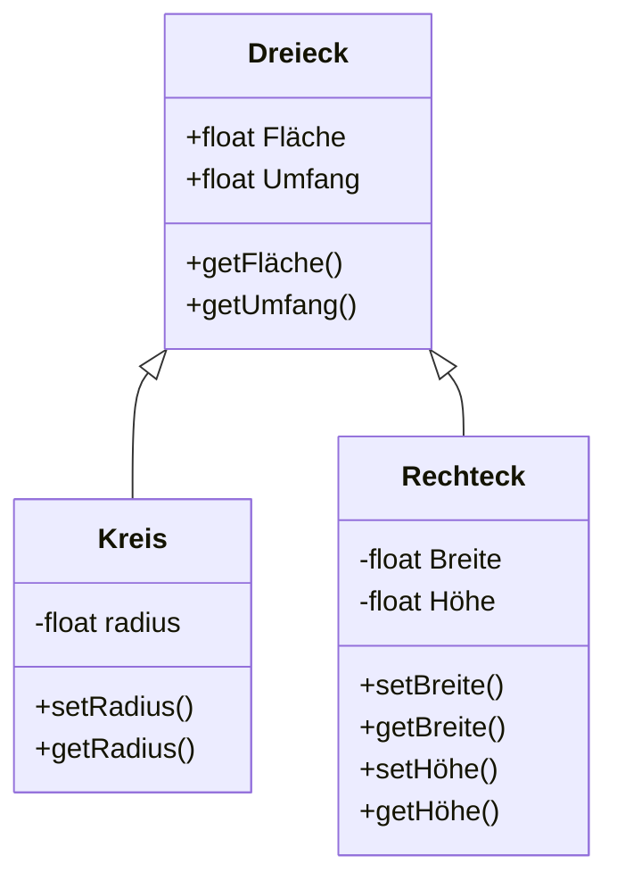

# Klassendiagramme
Ein Klassendiagramm ist ein bestimmtes Diagramm aus der Familie der UML-Diagramme (UnifiedModelingLanguage).

In einem Klassendiagramm lassen sich die Attribute und Methoden von Klassen darstellen. Dabei werden folgende Symbole für die Kapselung der Attribute oder Methoden verwendet.
- public wird mit + dargestellt
- private wird mit - dargestellt 
- protected wird mit # dargestellt

Weiters können in einem Klassendiagramm auch Abhängigkeiten zwischen Klassen modeliert werden.

Ein Klassendiagramm kann besonders einfach mit
z.B. https://mermaid.live/ erzeugt werden.

## Konzepte des objektorientierten Programmierens

- Abstraktion (abstraction)
 Klassen repräsentieren reale Dinge in abstrahierter Form.
- Kapselung (encapsulation)
 Zuweisung von public, protected und private an die Attribute und Methoden.
- Vererbung (inheritance)
  Die Kindklasse erbt alle Methoden und Attribute der Elternklasse.
- Polymorphismus (polymorphism)
 Durch Überschreiben von Methoden ergibt sich unterschiedliches Verhalten der Objekte.