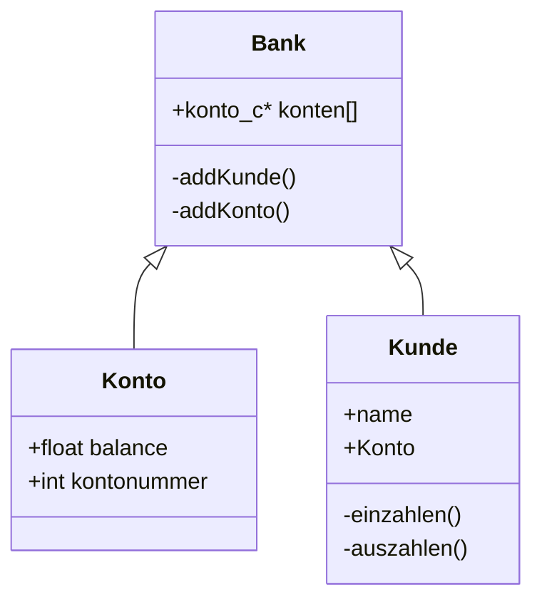

```mermaid
classDiagram

Bank <|-- Konto
Bank <|-- Kunde
Bank : +konto_c* konten[]
Bank : 
Bank: -addKunde()
Bank: -addKonto()
class Konto{
    +float balance
    +int kontonummer
    
}
class Kunde{
    +name
    +Konto
    -einzahlen()
    -auszahlen()

}


```