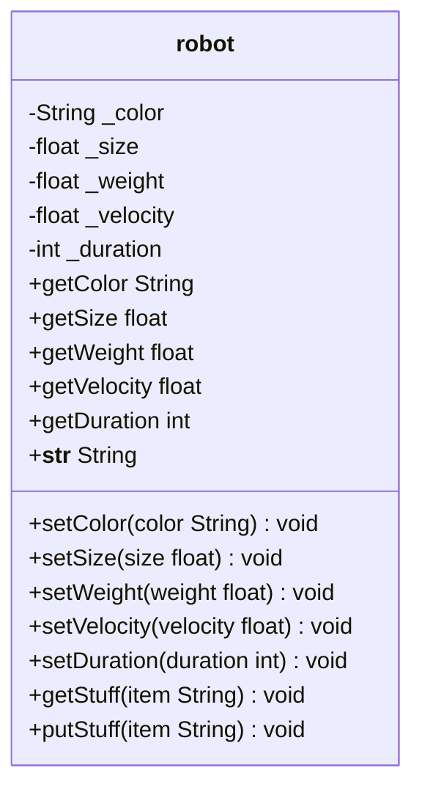

```mermaid
classDiagram
    robot : -String _color
    robot : -float _size
    robot : -float _weight
    robot : -float _velocity
    robot : -int _duration
    robot : +setColor(color String) void
    robot : +getColor String
    robot : +setSize(size float) void
    robot : +getSize float
    robot : +setWeight(weight float) void
    robot : +getWeight float
    robot : +setVelocity(velocity float) void
    robot : +getVelocity float
    robot : +setDuration(duration int) void
    robot : +getDuration int
    robot : +getStuff(item String) void
    robot : +putStuff(item String) void
    robot : +__str__ String

```