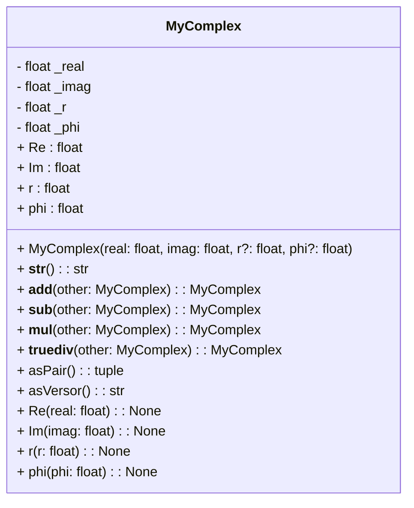

```mermaid
classDiagram
    class MyComplex {
        - float _real
        - float _imag
        - float _r
        - float _phi
        + MyComplex(real: float, imag: float, r?: float, phi?: float)
        + __str__() : str
        + __add__(other: MyComplex) : MyComplex
        + __sub__(other: MyComplex) : MyComplex
        + __mul__(other: MyComplex) : MyComplex
        + __truediv__(other: MyComplex) : MyComplex
        + asPair() : tuple
        + asVersor() : str
        + Re : float
        + Im : float
        + r : float
        + phi : float
        + Re(real: float) : None
        + Im(imag: float) : None
        + r(r: float) : None
        + phi(phi: float) : None
    }
```